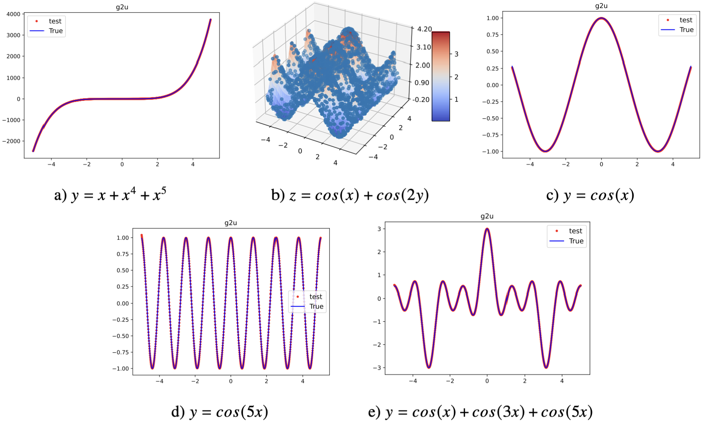
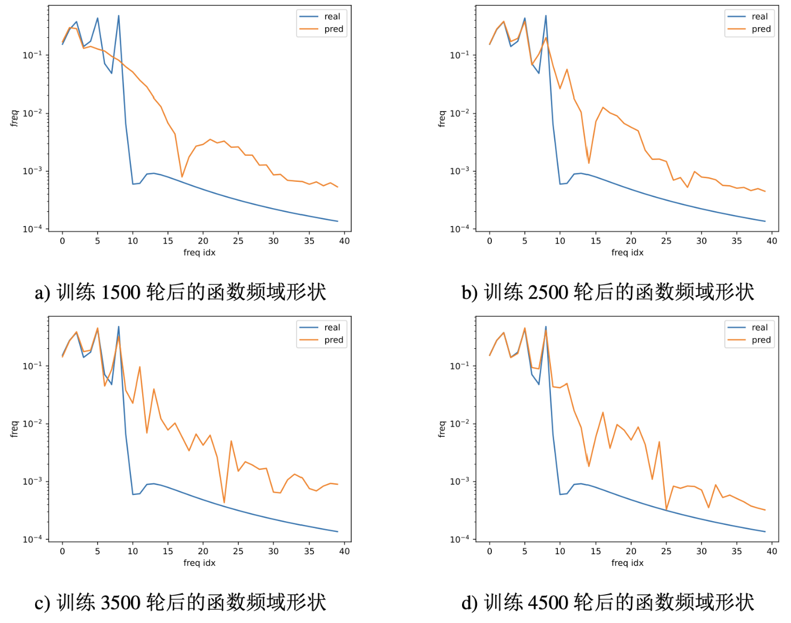
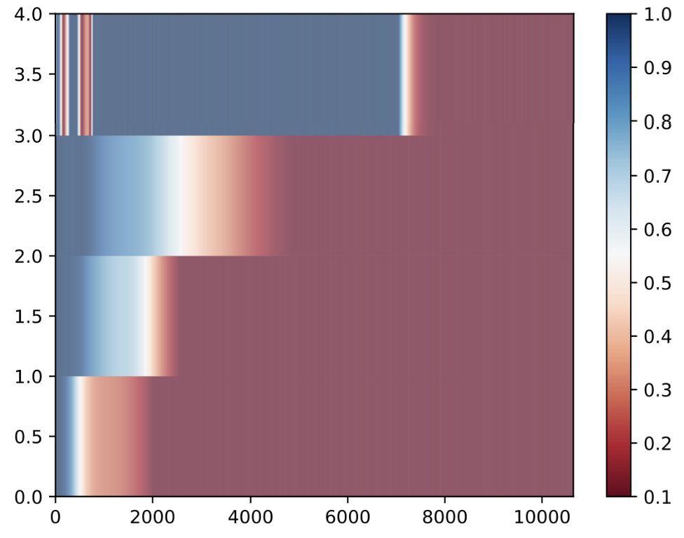

# Frequency Principle Demo
This project gives a simple verification of Frequency Principle proposed in [this paper](https://arxiv.org/abs/1901.06523).

## How to run
1. Set `'function'` in `configs.py` to `0,1,2,3,4` for four types of function.

2. Simply run `train.py`

## Fit Result

## Learning procedure in frequency domain 
Learning procedure visualization in frequency domain when fitting `y=cos(x)+cos(3x)+cos(5x)`.

## Heat map
Loss heat map of frequency domain when fitting `y=cos(x)+cos(3x)+cos(5x)`.

